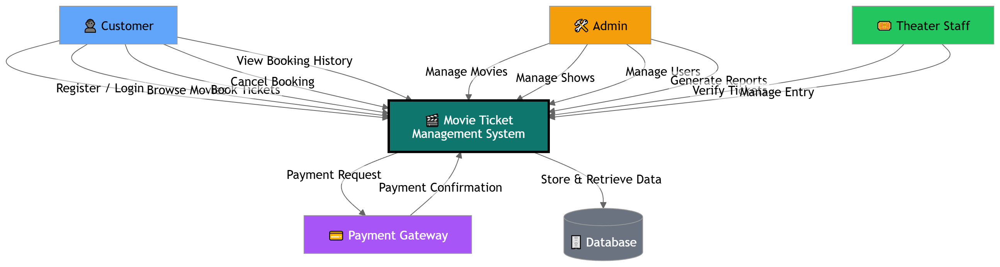

# Software Requirements Specification (SRS)

# Movie Ticket Management System

---

## Preface

This document provides the Software Requirements Specification (SRS) for the Movie Ticket Management System. It defines the system functionalities, performance requirements, security features, and architecture needed for development and deployment.

---

## Version History

* **Version 1.0** – Initial Draft.
* **Version 1.1** – Added non-functional requirements and system models.
* **Version 1.2** – Updated future enhancements and database requirements.

---

# 1. Introduction

## Purpose

The Movie Ticket Management System is a web-based application designed to simplify movie ticket booking and cinema management processes. The system allows users to browse movies, check show schedules, book seats, make payments, and receive booking confirmations online. It also helps administrators manage movies, theaters, schedules, and customer bookings efficiently.

---

## Document Conventions

This document follows the IEEE SRS standard using:

* **Must** – Mandatory requirements.
* **Should** – Recommended features.
* **May** – Optional enhancements.

---

## Intended Audience and Reading Suggestions

* **Developers & System Designers** – For implementation guidance.
* **Project Managers** – For project planning and monitoring.
* **Stakeholders & Clients** – To understand system functionality.
* **Testers & QA Teams** – For validating software requirements.

---

## Scope

The system provides:

* Online movie ticket booking
* Seat selection and reservation
* Movie and schedule management
* Secure online payment system
* User authentication and profile management
* Booking history and ticket cancellation
* Notifications and booking confirmations
* Admin dashboard and reporting system

---

## References

* IEEE Standard 830-1998 (Software Requirements Specification)
* Software Engineering Documentation
* Internal Business Requirement Specification (BRS)

---

# 2. Overall Description

## Product Perspective

The Movie Ticket Management System is a standalone web application that can integrate with online payment gateways and notification services such as email and SMS APIs.

---

## Product Functions

* **User Registration & Login:** Users can create accounts and log in securely.
* **Movie Browsing:** Users can view available movies, showtimes, and details.
* **Seat Booking:** Users can select seats and reserve tickets.
* **Payment Processing:** Users can pay online using supported payment methods.
* **Booking Management:** Users can view, download, or cancel booked tickets.
* **Admin Management:** Admins can manage movies, theaters, schedules, and users.
* **Notifications:** The system sends booking confirmations and reminders.

---

## User Classes and Characteristics

### Admin

* Manages movies, schedules, theaters, and users.
* Generates reports and monitors bookings.

### Customer/User

* Registers and logs into the system.
* Books and manages movie tickets.

### Theater Staff (Optional)

* Verifies tickets and manages show availability.

---

## Operating Environment

* Web-based application accessible through:

  * Google Chrome
  * Mozilla Firefox
  * Microsoft Edge
* Cloud-hosted infrastructure
* Database: MySQL / MongoDB

---

## Design and Implementation Constraints

* The system must support secure online transactions.
* The application must comply with data privacy and security standards.
* The system should support high traffic during peak booking hours.

---

## Assumptions and Dependencies

* Internet connection is required.
* Payment gateway services must be available.
* SMS/Email APIs are required for notifications.

---

# 3. System Requirements Specification

# Functional Requirements

## User Authentication

* The system must allow users to register and log in.
* The system must support password reset functionality.
* The system must provide role-based authentication (Admin, Customer).

---

## Movie Management

* Admins must be able to add, update, and remove movies.
* The system must display movie details including:

  * Movie title
  * Genre
  * Duration
  * Release date
  * Ratings
  * Trailer

---

## Theater & Show Management

* Admins must be able to create theaters and show schedules.
* The system must display available showtimes.
* The system must track available and booked seats.

---

## Ticket Booking

* Users must be able to select seats visually.
* The system must prevent double booking of seats.
* Users must receive booking confirmation after successful payment.

---

## Payment System

* The system must support secure online payments.
* Payment receipts should be generated automatically.
* The system must maintain transaction history.

---

## Booking Cancellation

* Users must be able to cancel tickets before the show starts.
* Refund policies should be managed by the admin.

---

## Notifications

* The system must send:

  * Booking confirmations
  * Payment confirmations
  * Show reminders
  * Cancellation notifications

---

## Reporting & Analytics

* Admins must be able to generate reports for:

  * Ticket sales
  * Revenue
  * Movie popularity
  * User activity

* Reports should be exportable in PDF and CSV formats.

---

# Non-Functional Requirements

## Performance Requirements

* The system must support 1000+ concurrent users.
* Booking and payment processing should complete within 5 seconds.
* Seat availability must update in real time.

---

## Security Requirements

* User passwords must be encrypted.
* Secure payment gateway integration must be implemented.
* The system must prevent unauthorized access.

---

## Usability Requirements

* The system should provide a user-friendly interface.
* The booking process should be simple and responsive.
* The system should support mobile-friendly design.

---

## Reliability and Availability

* The system must ensure 99.9% uptime.
* Backup and recovery systems must be implemented.

---

## Maintainability and Support

* The system should support modular updates.
* Error logging and debugging features must be available.

---

## Portability

* The system should work on Windows, Linux, and Mac.
* The system must support cloud deployment.

---

# 4. System Models

> * **CONTEXT DIAGRAM**

# 5. System Evolution

## Assumptions

* Mobile application support may be added in the future.
* AI-based movie recommendation features may be integrated.
* The system should scale for multiple cinema branches.

---

## Expected Changes

* Integration with digital wallets and payment services.
* QR code-based e-ticket verification.
* Online food ordering with ticket booking.
* Multi-language support.

---

# 6. Appendices

## Hardware Requirements

* Cloud-based server infrastructure
* Minimum 8 GB RAM server
* Stable internet connection

---

## Database Requirements

The database must maintain logical relationships between:

* Users
* Movies
* Theaters
* Shows
* Seats
* Bookings
* Payments

---

## Software Requirements

* Frontend: HTML, CSS, JavaScript, React (Optional)
* Backend: Node.js / PHP / Django
* Database: MySQL / MongoDB
* Server: Apache / Nginx
